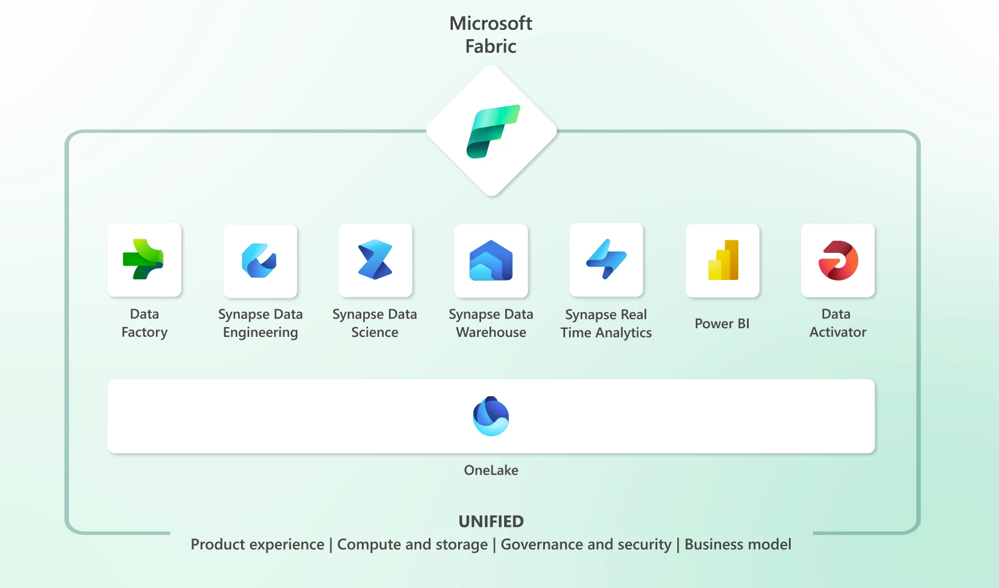
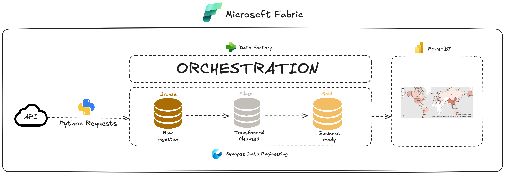
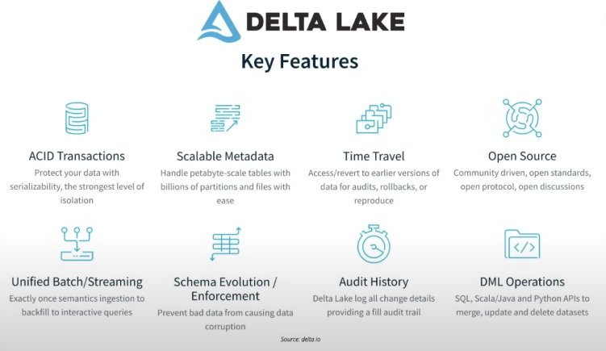

# Earthquake data pipeline using Microsoft Fabric

## Objective
The objective of this project is to get hand-on exposure of Microsoft Fabric.
It's a starting point before diving deeper into the Microsoft world.

## Setting up
This project will be done in the Microsoft Fabric environment.
If you're new to it like me, what is Fabric ?

Fabric offers a 60-day free trial, so let's create an account [here](https://www.microsoft.com/en-us/microsoft-fabric/getting-started).



Fabric offers the following solutions :
- Power BI: lets you easily connect to your data sources, visualize, and discover what's important, and share that with anyone or everyone you want.

- Data Factory: provides a modern data integration experience to ingest, prepare, and transform data from a rich set of data sources.

- Industry Solutions: industry-specific data solutions that address unique industry needs and challenges, and include data management, analytics, and decision-making.

- Real-Time Intelligence: an end-to-end solution for event-driven scenarios, streaming data, and data logs.

- Data Engineering: provides a Spark platform with great authoring experiences. It enables you to create, manage, and optimize infrastructures for collecting, storing, processing, and analyzing vast data volumes.

- Data Science: enables you to build, deploy, and operationalize machine learning models from Fabric.

- Data Warehouse: provides industry leading SQL performance and scale. It separates compute from storage, enabling independent scaling of both components.

## Architecture
Now that we have an overall idea about the components of Microsoft Fabric, here are the components that will be useful for this project : 

### Data Source
I will be using the USGS Earthquake data for this project, extracting it through an API using Python and Spark.

### Data Engineering
I will then incrementally process the data using the medallion architecture, which is a design pattern used to logically organise data in a lake house, with the goal of progressively improving the structure and quality of data as it flows through each layer :
- Bronze : data in its raw form, largely unchanged from the source
- Silver : involves cleansing and transforming the data, making corrections and consolidations as needed 
- Gold : where the most refined and business ready data resides, optimized for high value actionable insights, often tailored for specific business needs

All of this will be done using Synapse Data Engineering.

### Data Orchestration
Once the Data Engineering notebooks are created, I will use Data Factory to orchestrate and automate them to ingest and append the data to the bronze, silver and gold layers on daily basis.


### Data Analysis and reporting
I will create a Power BI report to show the worldwide earthquake data events.

 
_Diagram created using [Excalidraw](https://excalidraw.com/)._

## Getting started
### Creating a lakehouse
First thing we need to do is to create a new workspace.
On the MS Fabric main screen, select Data Engineering, and on the left panel click on Workspaces > New workspace.

Once created, click on New item, and select Lakehouse. You can call it earthquakes_lakehouse.
This lakehouse will store the processed earthquake events data ingested from the API in raw format. 
We will later process it downstream and store it as cleansed and reporting ready Delta format tables, which is the default format for tables in Fabric.

 

If you have never heard of the term lakehouse before, the lakehouse architecture combines the best features of data lakes and data warehouses : it stores both structured and unstructured data, and is optimized for both large scale data storage, and high performance BI analytics.

You will notice, that by default, when creating your new central data repository lakehouse, Fabric created both :
- a semantic model, which is a layer that defines the business logic and the relationships between the data. It is typically a star schema and is created and kept in-sync automatically without user intervention.
- and an SQL analytics endpoint, that provides an SQL-based interface to execute queries on the data stored in the lakehouse. 

You can switch between them on the top right corner.

### Extracting the API data : Bronze layer
For this project I will be using the USGS Earthquake Catalog.
You can find all the information you need about it [here](https://earthquake.usgs.gov/fdsnws/event/1/#parameters).

The most important part for me is the query to to submit a data request, which looks like this :
https://earthquake.usgs.gov/fdsnws/event/1/query?format=geojson&starttime=2014-01-01&endtime=2014-01-02

Notice that we can choose, a format, a start time and an end time.

In the Fabric workspace, select New Item > Notebook.
Link the notebook to the previously created lakehouse by clicking Lakehouses on the left panel > Existing Lakehosue without Schema.
Make sure the language is PySpark.

You can find this notebook, that extracts the data for a specific day and stores it as a json file, here :
Notebooks/01 Worldwide Earthquake Events API - Bronze Layer Processing

### Processing the data : Silver layer
Go back to the workspace the create a new notebook, once again linking it to earthquakes_lakehouse.

In this notebook, using PySpark, we will read the earthquake data (json) into a dataframe :
```python
display(df.select(col('geometry.coordinates').getItem(0).alias('longitude')))
display(df.select(col('properties.mag').alias('magnitude')))
```

We also need to change the time values, from UNIX timestamp in milliseconds, into a standard timestamp format. First dividing it by 1000 to get it in seconds, and then casting it into a timestamp.

```python
df.withColumn('time', col('time')/1000).withColumn('time', col('time').cast(TimestampType()))
```

And finally we write the dataframe to a table, using the append mode.
So everyday the data will be added to the same table.

```python
df.write.mode('append').saveAsTable('earthquake_events_silver')
```

You can find this notebook, that processes the data and stores it in a table here :
Notebooks/02 Worldwide Earthquake Events API - Silver Layer Processing

### Getting the data ready for reporting : Silver layer
By now we know the drill, create a new notebook and attach it to the lakehouse.
By the new you can create a notebook not only from the workspace, but also directly from the lakehouse, in which case it will be automatically attached to the lakehouse.

In this notebook, we will read the table created in the silver model, by filtering it on a specific start_data to avoid duplicates.
```python
df = spark.read.table("earthquake_events_silver").filter(col('time') > start_date)
```

Then add a country code to use for Power BI, based on the longitude and latitude coordinates, with the help of [reverse_geocoder library](https://pypi.org/project/reverse_geocoder/).

Since we will be using an external library, we need to create a new environment for the notebook, on the top bar. Go to your newly created environment > Public libraries > Add from PyPi > reverse-geocoder > Publish

```python
import reverse_geocoder as rg

coordinates = (40.09, 9.0623)
rg.search(coordinates)[0].get('cc')
```

We will also add a classification for the significance of the earthquake : low, moderate, high.

```python
df_with_location.\
	withColumn('sig_class',
		when(col("sig") < 100, "Low").\
		when((col("sig") >= 100) & (col("sig") < 500), "Moderate").\
		otherwise("High")
)
```

And finally write the dataframe to a gold table, using the append mode.

```python
df_with_location_sig_class.write.mode('append').saveAsTable('earthquake_events_gold')
```

You can find this notebook, that processes the data and stores it in a table here :
Notebooks/03 Worldwide Earthquake Events API - Gold Layer Processing

### Creating the Power BI report
The semantic model that was automatically created, can be loaded directly into Power BI without having to query a lakehouse or an SQL endoint. 
It's a fast path to load the data directly from the lake into the reports.
Open the lakehouse > SQL analytics endpoint > Reporting (top left) > Manage default semantic model and select earthquake_events_gold.

On the bottom left corner, switch from Data Engineering to Power BI, and click on New Report > Pick a published semantic model.
You can either create a blank report, or have Fabric automatically generate one for you.

For this report, we will need Map visuals. After saving the report, go to Setting (top right) > Admin Portal and search for Map and filled map visuals which should be turned on.
